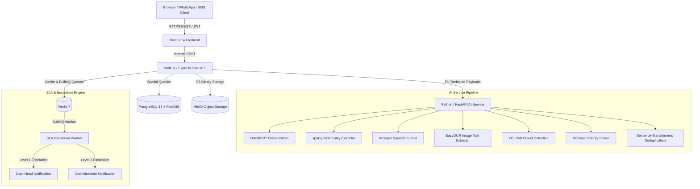
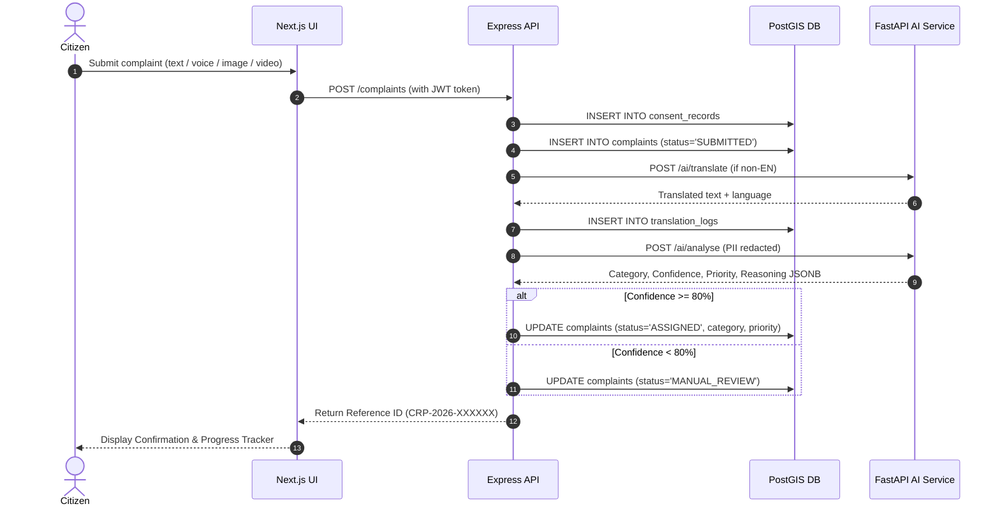
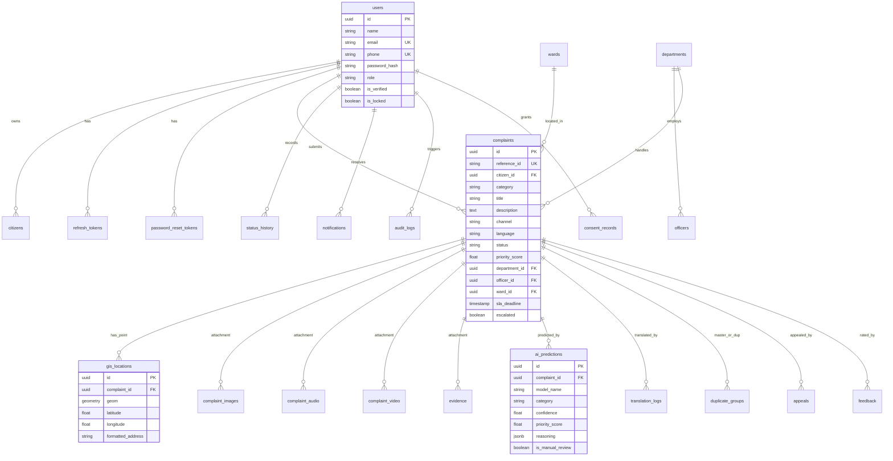

# System Architecture & Diagrams — Community Redressal Planner

## 1. System Architecture Diagram

---

## 2. Complaint Intake & AI Understanding Sequence Diagram

---

## 3. Database Entity Relationship (ER) Diagram

